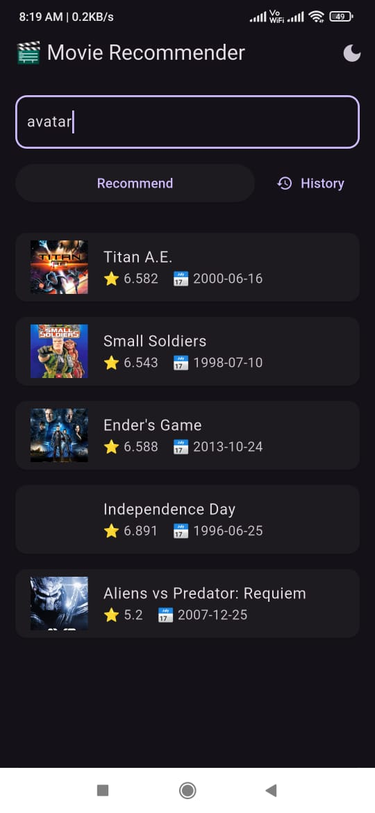

# 🎬 MovieAI – AI-Powered Movie Recommender


MovieAI is a Flutter-based mobile application powered by Machine Learning, capable of recommending movies based on user input. The app fetches intelligent recommendations from a live Flask-based API using content-based filtering, powered by TMDB data.

---

## 🚀 Features

- 🔍 **Movie Recommendation Engine** using ML (no deep learning)
- 🎨 **Modern Flutter UI** with Hero animations & shimmer loading
- 🌓 **Light/Dark theme toggle** with smooth transitions
- 🧠 **Live deployed Flask API** (Render.com)
- 🔁 **Search history tab** (with persistent local storage)
- 📱 **Android-ready APK** with custom splash & launcher icon
- 💥 Built using GetX, Shimmer, and GetStorage

---

## 📸 Screenshots

| Splash Screen | Recommendation UI | Movie Details | History Tab |
|---------------|-------------------|---------------|-------------|
|  |  |  |  |


---

## 🧠 Tech Stack

### Frontend (Flutter)
- `GetX` for state management and routing
- `Shimmer` for loading effects
- `GetStorage` for persistent history
- `flutter_native_splash` and `flutter_launcher_icons`

### Backend (Python + Flask)
- `Scikit-learn`, `Pandas`, `Joblib`, `TMDB API`
- Content-based similarity with cosine distances
- Hosted via Render

---

## 📦 Installation (Frontend)

```bash
git clone https://github.com/yourusername/moviesai.git
cd moviesai
flutter pub get
flutter run
🌐 API Endpoint (Backend)
http
Copy
Edit
POST https://movies-ai-api.onrender.com/recommend

{
  "movie": "Avatar"
}

📱 APK Download
⬇ Download APK
(https://drive.google.com/file/d/1P6SrxaiVtjnDxCo8996kmGuxwg3rkqig/view?usp=sharing)

💡 Future Enhancements
🔖 Bookmark/Favorite movies

🎞️ Genre tags and TMDB profile links

🧭 Bottom navigation bar

🌐 Flutter Web + PWA support

📜 License
MIT License © SaranshDataAI
